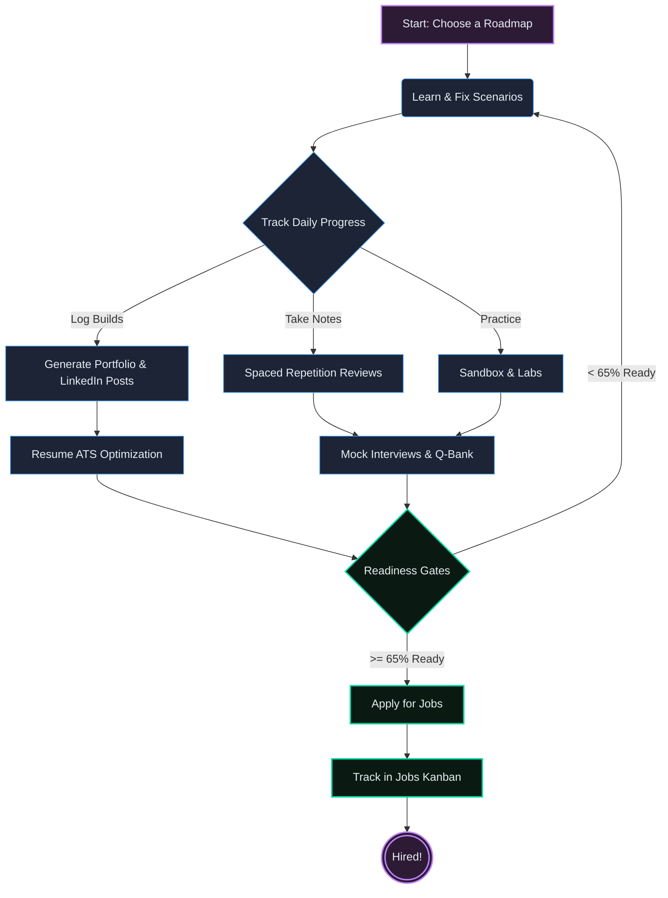

# Project Guide: DevOps 90-Day Tracker

Welcome to the comprehensive guide for the DevOps 90-Day Tracker. This document explains the core philosophy behind this project and details the purpose of each feature, view, and tool included in the application.

## 🎯 The Core Philosophy: "Zero to Hired"

This project is **not** a traditional tutorial tracker where you just check off reading assignments. It is a purpose-built **Job Placement Tool** designed to transform you from an absolute beginner to a hired DevOps Engineer within 90 days.

Every single feature in this app was built to answer one question: *"Does this help someone get a DevOps job faster?"* 

Instead of just learning theory, this app focuses on:
- **Problem-First Learning**: You start your day with a broken server or a failed deployment, and you learn the tools by fixing it.
- **Proof of Work**: You build a real portfolio of projects and daily logs that prove your competence to recruiters.
- **Interview Readiness**: You continuously test your knowledge against actual interview questions and ATS (Applicant Tracking System) resume scanners.

### The "Zero to Hired" Workflow

---

## 🧭 Roadmaps

The tracker offers two distinct roadmaps that run simultaneously, allowing you to choose the learning style that fits you best (or use both).

### 1. The Original Roadmap (v4)
- **What it is:** A structured, topic-first 90-day plan.
- **How it works:** It breaks down DevOps into 6 phases (e.g., Learn Linux → Learn Docker → Learn Kubernetes). You study the concepts, take AI-generated quizzes, and track your confidence scores.

### 2. The Problem-First Roadmap (v2) 💥
- **What it is:** A completely new, scenario-driven approach to learning DevOps.
- **How it works:** Instead of reading about a topic, every day starts with a real-world production incident (e.g., "The disk is full and the server refuses all connections"). You are forced to learn the commands and concepts necessary to resolve the crisis, mirroring the day-to-day life of a real DevOps Engineer.

---

## 🛠️ Feature Breakdown: What Everything Does

The application is divided into several modules, each targeting a specific aspect of the job hunt and learning process.

### 📚 Study & Learning
- **Q-Bank:** A repository of over 200+ DevOps interview questions categorized by topic (Linux, Docker, K8s, Terraform, CI/CD). Use this to drill specific technologies.
- **Notes:** A secure, locally authenticated notebook to jot down your learnings, command snippets, and thoughts. It requires a password to access, keeping your personal notes safe.
- **Sandbox:** A fully functional, in-browser DevOps environment. Practice Linux commands, write Python scripts, or simulate Git workflows without leaving the app or setting up complex local environments.
- **Focus Mode:** A distraction-free view that isolates the tasks for a single day. Perfect for deep-work sessions where you want to tackle a specific topic without being overwhelmed by the entire 90-day plan.
- **Labs:** Interactive terminal simulators that provide a safe space to practice dangerous or complex commands before running them on a real server.

### 📋 Tracking & Progress
- **Build Log & Reviews:** 
  - **Build Log:** A daily journal where you log what you built, what broke, and what you learned. This automatically generates a professional portfolio you can show to recruiters.
  - **Reviews:** A spaced-repetition flashcard system. If you rate your confidence on a task poorly, the app will automatically schedule a review for it in the future to ensure you don't forget the material.
- **Goals:** A weekly planning tool to set your targets, track your daily login streaks, and manage your momentum. It includes "bounceback" tracking to help you recover if you miss a few days.
- **Stats:** The ultimate dashboard for your progress. It displays your overall completion rate, "DORA" style metrics, XP (Experience Points) and leveling, study hours, and an activity heatmap to visualize your consistency over the last 3 months.

### 💼 Job Outcome Tools
- **Resume:** Paste your current resume and the app's AI will scan it against an ATS (Applicant Tracking System) simulator. It will highlight missing keywords and suggest improvements based on the seniority level you are targeting.
- **Mock Interview:** A high-pressure, timed AI interview simulator. You have 2 minutes to answer a random technical question. The AI grades your response and identifies your weak points.
- **GitHub Rewriter:** First impressions matter. This tool audits your public GitHub repositories and uses AI to suggest professional repository names and generate high-quality `README.md` templates.
- **Jobs:** A Kanban-style board specifically for tracking your job applications. Move opportunities from "Applied" to "Screening", "Technical Interview", and finally "Offer".
- **Skill Gap:** Paste a job description from LinkedIn or Indeed, and the app will cross-reference it with the skills you've acquired on the roadmap, showing you exactly what you need to brush up on before applying.
- **Readiness:** Stop waiting until you feel "100% ready" (because you never will). This tool uses an 8-gate checklist (combining your quiz scores, project completions, and resume strength) to definitively tell you whether you are ready to start applying.
- **LinkedIn:** Writing posts is hard. This tool takes your daily "Build Log" entries and uses AI to transform them into engaging LinkedIn posts. You can choose the tone: technical, story-driven, or insightful.
- **Projects:** 12 detailed specifications for portfolio projects. More importantly, it provides exactly what you should put on your resume for each project (the "resume bullet") and how to talk about it in an interview (the "talking points").

---

## 💾 How Your Data is Stored

Privacy and speed are paramount. This application does **not** use a backend database and requires **no account creation** (except for the local Notes password).

All of your progress, notes, tasks, and configurations are saved locally in your browser's `localStorage`. This means the app loads instantly and works offline, but it also means your data remains on your device. 

*Tip: You can export your progress from the Stats dashboard if you need to move to a different computer or want to back up your portfolio.*
